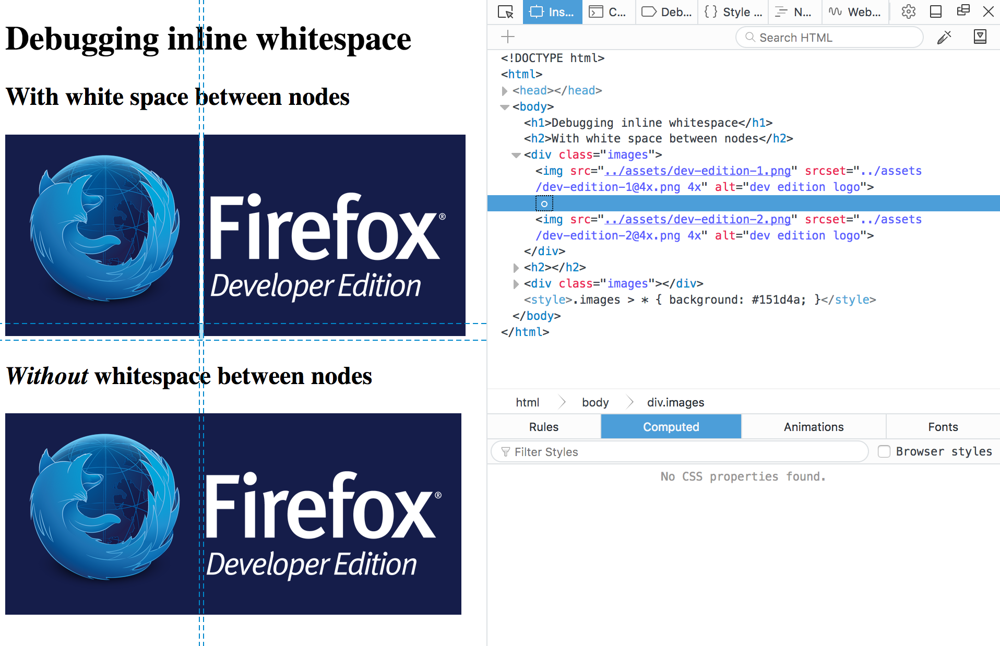

# Debugging inline whitespace

Web developers don't write all their code in just one line of text. They use white space between their HTML elements because it makes markup more readable: spaces, returns, tabs.

In most instances, this white space *seems* to have no effect and no visual output, but the truth is that when a browser parses HTML it will automatically generate anonymous text nodes for elements not contained in a node. This includes white space (which is, after all a type of text).

If these auto generated text nodes are <a href="https://developer.mozilla.org/en-US/docs/Web/Guide/CSS/Visual_formatting_model#Inline-level_elements_and_inline_boxes">inline level</a>, browsers will give them a non-zero width and height, and you will find strange gaps between the elements in the context, even if you haven't set any margin or padding on nearby elements.

This behaviour can be hard to debug, but Firefox DevTools are now able to display these whitespace nodes, so you can quickly spot where do the gaps come from in your markup, and fix the issues.

## Demo

The demo shows two examples with slightly different markup to highlight the differences both in browser rendering and what DevTools are showing.

The first example has one <tt>img</tt> per line, so the markup is readable, but the browser renders gaps between the images. The second example has all the <tt>img</tt> tags in one line, which makes the markup unreadable, but it also doesn't have gaps in the output.

If you inspect the nodes in the first example, you'll find a new whitespace indicator that denotes the text nodes created for the browser for the whitespace in the code. No more guessing! You can even delete the node from the inspector, and see if that removes mysterious gaps you might have in your website.
