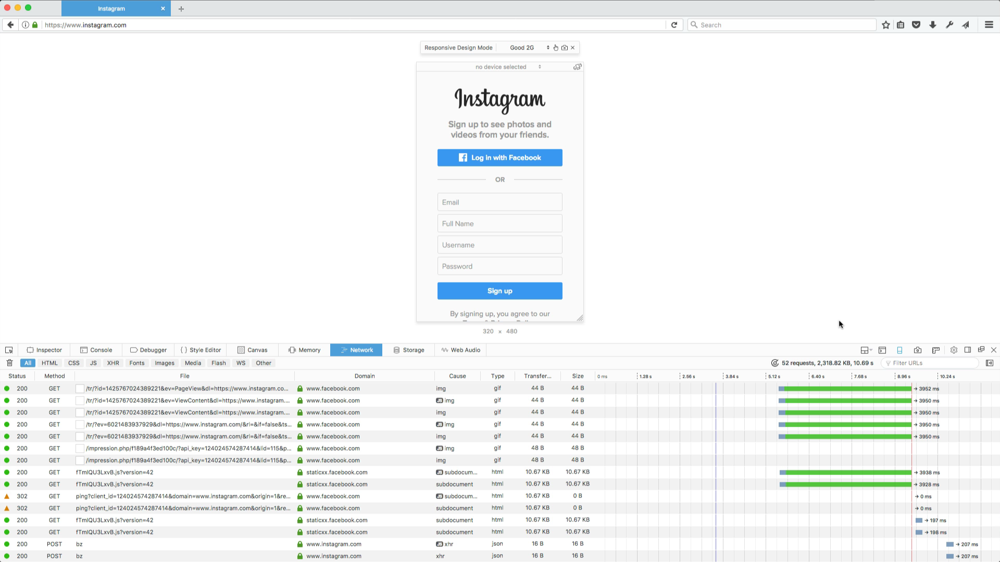

# Network Throttling ([Bug 1283453](https://bugzilla.mozilla.org/show_bug.cgi?id=1283453))

When you're building a responsive site meant to perform well on many different
devices, it's important to consider the network connection as well.

Sites that use many heavy resources like fonts and images can delay page load
significantly, especially on a slow mobile connection.  Fortunately, there are
tools to simulate slow connections so you can get a rough idea of the user
experience with different connection types.

## Demo

The demo video showcases the network throttling control inside Responsive Design
Mode.

A page is first loaded over a normal connection with the network monitor open to
watch the resources come in.  Then the connection is changed to relatively slow
and the page is reloaded, leading to pauses and delays as various resources
slowly pop in.

There are various different connection types available ranging from high
bandwidth, low latency connections similar to wired broadband down to low
bandwidth, high latency connections like GPRS on mobile.
